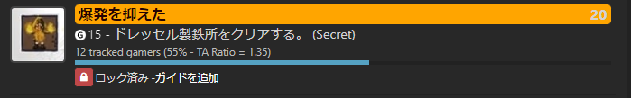
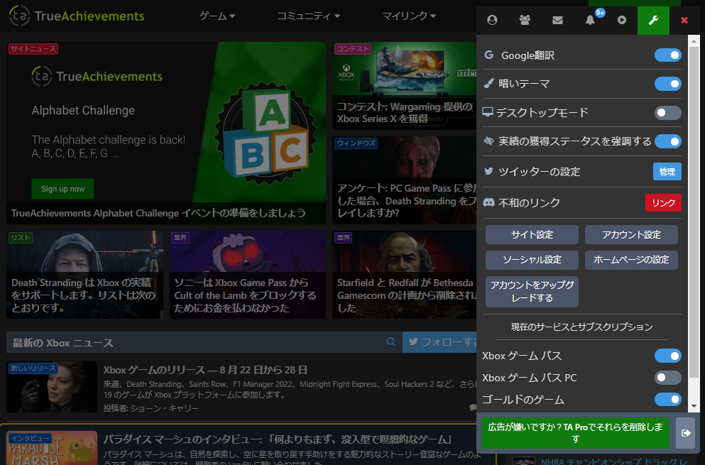

  <h1>TrueAchievement Revealed</h1>

## Description
View the details of the Secret Achievements of Trueachivements. 
This will free you from the cumbersome mouse operation. 
Also, by translating the English content into Japanese, you will be able to enjoy a comfortable game life! 

## Features
- Automatic display of secret achievements
  
- Japanese translation by Google Translate
  
- Quick Ad block

## Installation
To use this script, you need a userscript manager. 
This script works in Google Chrome.(not tried with other web browsers.)

- Install [Tampermonkey](https://chrome.google.com/webstore/detail/tampermonkey/dhdgffkkebhmkfjojejmpbldmpobfkfo) 
- <s>Install [Google Translate](https://chrome.google.com/webstore/detail/google-translate/aapbdbdomjkkjkaonfhkkikfgjllcleb) </s>
- Then, click on [this link](https://github.com/akanesign/trueachivement/raw/main/true_achievements_without_hiding.user.js) and a new tab should open, prompting you with an installation screen.
- Hit install and you should be good to go!
